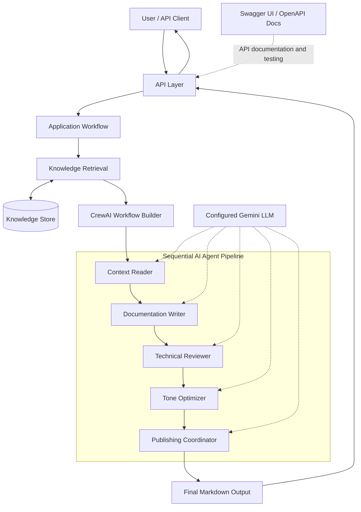

# GitLab AI Content Engine

## Architecture Documentation

## 1. Project Overview

The GitLab AI Content Engine is an AI-powered application designed to generate accurate, source-grounded technical documentation using Large Language Models (LLMs) and a sequential multi-agent workflow.

The application uses specialized AI agents to analyze context, write documentation, review technical accuracy, improve readability, and prepare the final customer-facing Markdown output.

## 2. Technology Stack

* **Python:** Core application development
* **Google Gemini:** Configured language model
* **CrewAI:** AI agent and task orchestration
* **ChromaDB:** Vector storage and retrieval, where configured
* **Pydox and Pytext:** text extraction, where implemented
* **API Layer:** Communication between clients and application functionality
* **Swagger / OpenAPI:** API documentation and interactive testing, when configured
* **Pytest:** Automated testing
* **Git and GitHub:** Version control and collaboration

## 3. System Architecture

The system separates application processing, AI workflow orchestration, specialized agents, and output generation. Knowledge retrieval and API interactions are included according to the implemented application flow.

### 3.1 Architecture Diagram

*Note: The five-agent sequence is confirmed by `backend/ai/agents/crew.py`. The knowledge-store, API, and Swagger connections should be retained only where they match the actual implementation.*

## 4. AI Agent Architecture

The project defines five specialized agents through `ROLE_DETAILS` in `backend/ai/agents/crew.py`.

| Agent                  | Responsibility                                                              |
| ---------------------- | --------------------------------------------------------------------------- |
| Context Reader         | Extracts source-grounded facts, gaps, and references.                       |
| Documentation Writer   | Creates accurate technical documentation from available evidence.           |
| Technical Reviewer     | Checks the draft against source evidence and produces review findings.      |
| Tone Optimizer         | Improves clarity and audience suitability without adding unsupported facts. |
| Publishing Coordinator | Prepares the final customer-facing Markdown output.                         |

## 5. AI Workflow

The `build_crew()` function creates agents and their corresponding tasks dynamically from `ROLE_DETAILS`.

The workflow operates as follows:

1. The application provides task inputs and the configured language model.
2. The workflow builder creates the five agents and their tasks.
3. The Context Reader extracts relevant facts and references.
4. The Documentation Writer generates the initial draft.
5. The Technical Reviewer checks the draft against the available evidence.
6. The Tone Optimizer improves readability and tone.
7. The Publishing Coordinator prepares the final Markdown output.

The workflow uses `Process.sequential`, so tasks run in sequence. Previous task context is passed to subsequent tasks as configured in the code. Agent delegation is disabled using `allow_delegation=False`.

## 6. API Documentation with Swagger / OpenAPI

Swagger UI provides an interactive interface for exploring and testing API endpoints when it is enabled in the application.

### Purpose of Swagger

* **Endpoint discovery:** View the available API routes and supported operations.
* **Request testing:** Submit requests with the required parameters or request body.
* **Response inspection:** Examine response data and HTTP status codes.
* **Schema documentation:** Understand the expected request and response structures.
* **Error validation:** Inspect error responses for invalid or unsupported requests.

OpenAPI defines a standard description of the API, while Swagger UI presents that description in an interactive interface.

Swagger is primarily used for API documentation and manual endpoint testing. It does not replace automated tests or validate the quality of every AI-generated response.

*The actual Swagger URL and availability depend on the application's API framework and configuration.*

## 7. Testing and Validation

Project testing was reported as completed with **25 out of 25 tests passing**.

| Test Metric          | Result |
| -------------------- | -----: |
| Total tests reported |     25 |
| Passed               |     25 |
| Failed               |      0 |

Testing activities include AI workflow validation, expected-output checks, and API testing for the implemented scenarios.

The test results demonstrate that the reported test cases passed. Actual coverage depends on the test cases and assertions implemented in the repository.

## 8. Security and Configuration

* Store API credentials in environment variables or a suitable secrets-management system.
* Do not commit API keys or other sensitive configuration to GitHub.
* Validate incoming API requests.
* Handle AI provider and application errors appropriately.
* Keep internal review information separate from customer-facing output.

## 9. Conclusion

The GitLab AI Content Engine combines a configured language model with five specialized CrewAI agents to generate and refine technical documentation. Its sequential workflow separates context extraction, writing, technical review, tone optimization, and publishing. API documentation and testing tools support endpoint discovery and validation where configured.
